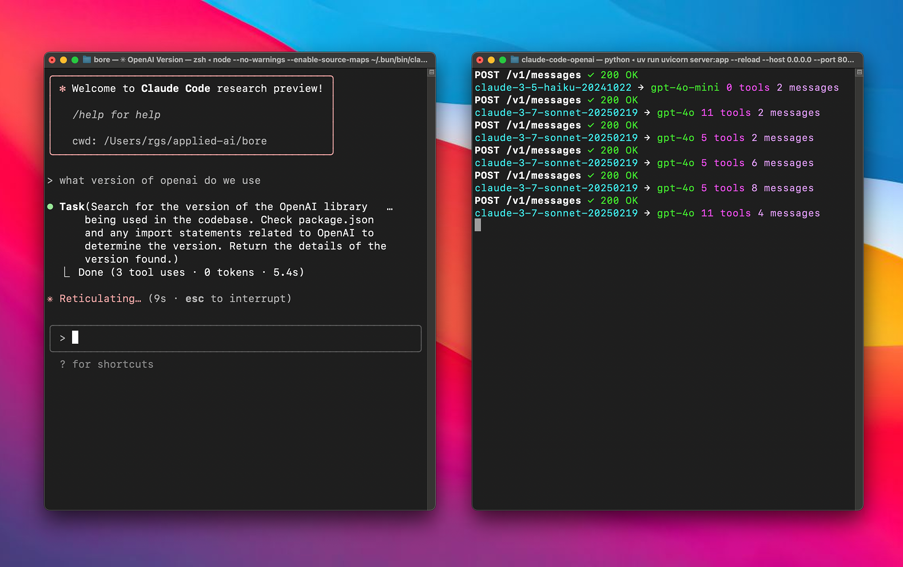

# Anthropic API Proxy for Gemini & OpenAI Models 🔄

**Use Anthropic clients (like Claude Code) with Gemini or OpenAI backends.** 🤝

A proxy server that lets you use Anthropic clients with Gemini or OpenAI models via LiteLLM. 🌉




## Quick Start ⚡

### Prerequisites

- OpenAI API key 🔑
- Google AI Studio (Gemini) API key (if using Google provider) 🔑
- [uv](https://github.com/astral-sh/uv) installed.

### Setup 🛠️

1. **Clone this repository**:
   ```bash
   git clone https://github.com/1rgs/claude-code-openai.git
   cd claude-code-openai
   ```

2. **Install uv** (if you haven't already):
   ```bash
   curl -LsSf https://astral.sh/uv/install.sh | sh
   ```
   *(`uv` will handle dependencies based on `pyproject.toml` when you run the server)*

3. **Configure Environment Variables**:
   Copy the example environment file:
   ```bash
   cp .env.example .env
   ```
   Edit `.env` and fill in your API keys and model configurations:

   *   `ANTHROPIC_API_KEY`: (Optional) Needed only if proxying *to* Anthropic models.
   *   `OPENAI_API_KEY`: Your OpenAI API key (Required if using the default OpenAI preference or as fallback).
   *   `GEMINI_API_KEY`: Your Google AI Studio (Gemini) API key (Required if PREFERRED_PROVIDER=google).
   *   `PREFERRED_PROVIDER` (Optional): Set to `openai` (default) or `google`. This determines the primary backend for mapping `haiku`/`sonnet`.
   *   `BIG_MODEL` (Optional): The model to map `sonnet` requests to. Defaults to `gpt-4.1` (if `PREFERRED_PROVIDER=openai`) or `gemini-2.5-pro-preview-03-25`.
   *   `SMALL_MODEL` (Optional): The model to map `haiku` requests to. Defaults to `gpt-4.1-mini` (if `PREFERRED_PROVIDER=openai`) or `gemini-2.0-flash`.

   **Mapping Logic:**
   - If `PREFERRED_PROVIDER=openai` (default), `haiku`/`sonnet` map to `SMALL_MODEL`/`BIG_MODEL` prefixed with `openai/`.
   - If `PREFERRED_PROVIDER=google`, `haiku`/`sonnet` map to `SMALL_MODEL`/`BIG_MODEL` prefixed with `gemini/` *if* those models are in the server's known `GEMINI_MODELS` list (otherwise falls back to OpenAI mapping).

4. **Run the server**:
   ```bash
   uv run uvicorn server:app --host 0.0.0.0 --port 8082 --reload
   ```
   *(`--reload` is optional, for development)*

### Using with Claude Code 🎮

1. **Install Claude Code** (if you haven't already):
   ```bash
   npm install -g @anthropic-ai/claude-code
   ```

2. **Connect to your proxy**:
   ```bash
   ANTHROPIC_BASE_URL=http://localhost:8082 claude
   ```

3. **That's it!** Your Claude Code client will now use the configured backend models (defaulting to Gemini) through the proxy. 🎯

## Model Mapping 🗺️

The proxy automatically maps Claude models to either OpenAI or Gemini models based on the configured model:

| Claude Model | Default Mapping | When BIG_MODEL/SMALL_MODEL is a Gemini model |
|--------------|--------------|---------------------------|
| haiku | openai/gpt-4o-mini | gemini/[model-name] |
| sonnet | openai/gpt-4o | gemini/[model-name] |

### Supported Models

#### OpenAI Models
The following OpenAI models are supported with automatic `openai/` prefix handling:
- o3-mini
- o1
- o1-mini
- o1-pro
- gpt-4.5-preview
- gpt-4o
- gpt-4o-audio-preview
- chatgpt-4o-latest
- gpt-4o-mini
- gpt-4o-mini-audio-preview
- gpt-4.1
- gpt-4.1-mini

#### Gemini Models
The following Gemini models are supported with automatic `gemini/` prefix handling:
- gemini-2.5-pro-preview-03-25
- gemini-2.0-flash

### Model Prefix Handling
The proxy automatically adds the appropriate prefix to model names:
- OpenAI models get the `openai/` prefix 
- Gemini models get the `gemini/` prefix
- The BIG_MODEL and SMALL_MODEL will get the appropriate prefix based on whether they're in the OpenAI or Gemini model lists

For example:
- `gpt-4o` becomes `openai/gpt-4o`
- `gemini-2.5-pro-preview-03-25` becomes `gemini/gemini-2.5-pro-preview-03-25`
- When BIG_MODEL is set to a Gemini model, Claude Sonnet will map to `gemini/[model-name]`

### Customizing Model Mapping

Control the mapping using environment variables in your `.env` file or directly:

**Example 1: Default (Use OpenAI)**
No changes needed in `.env` beyond API keys, or ensure:
```dotenv
OPENAI_API_KEY="your-openai-key"
GEMINI_API_KEY="your-google-key" # Needed if PREFERRED_PROVIDER=google
# PREFERRED_PROVIDER="openai" # Optional, it's the default
# BIG_MODEL="gpt-4.1" # Optional, it's the default
# SMALL_MODEL="gpt-4.1-mini" # Optional, it's the default
```

**Example 2: Prefer Google**
```dotenv
GEMINI_API_KEY="your-google-key"
OPENAI_API_KEY="your-openai-key" # Needed for fallback
PREFERRED_PROVIDER="google"
# BIG_MODEL="gemini-2.5-pro-preview-03-25" # Optional, it's the default for Google pref
# SMALL_MODEL="gemini-2.0-flash" # Optional, it's the default for Google pref
```

**Example 3: Use Specific OpenAI Models**
```dotenv
OPENAI_API_KEY="your-openai-key"
GEMINI_API_KEY="your-google-key"
PREFERRED_PROVIDER="openai"
BIG_MODEL="gpt-4o" # Example specific model
SMALL_MODEL="gpt-4o-mini" # Example specific model
```

## How It Works 🧩

This proxy works by:

1. **Receiving requests** in Anthropic's API format 📥
2. **Translating** the requests to OpenAI format via LiteLLM 🔄
3. **Sending** the translated request to OpenAI 📤
4. **Converting** the response back to Anthropic format 🔄
5. **Returning** the formatted response to the client ✅

The proxy handles both streaming and non-streaming responses, maintaining compatibility with all Claude clients. 🌊

## Contributing 🤝

Contributions are welcome! Please feel free to submit a Pull Request. 🎁

## 多渠道配置与模型路由（高级用法） 🚦

本代理支持**多渠道API路由**，可通过模型名后缀 `:渠道名` 灵活指定不同API端点和KEY，适用于多供应商/多账号/多代理等场景。

### 环境变量配置

在 `.env` 文件中添加如下内容：

```dotenv
# 默认渠道配置（向后兼容）
BASE_URL="https://gemini-balance.eqing.tech/openai/v1"
API_KEY="sk-UIpCcB7ic4xxxxxx8F5C68744"
GEMINI_API_KEY="sk-gemini-default"
OPENAI_API_KEY="sk-openai-default"
ANTHROPIC_API_KEY="sk-anthropic-default"

# 新增自定义渠道
CHANNEL_GEMINI2_BASE_URL="https://another-gemini-api.com/v1"
CHANNEL_GEMINI2_API_KEY="sk-gemini2-key"

CHANNEL_CLAUDE2_BASE_URL="https://another-claude-api.com/v1"
CHANNEL_CLAUDE2_API_KEY="sk-claude2-key"

# 其他配置保持不变
PREFERRED_PROVIDER="openai"
BIG_MODEL="openai/gemini-2.5-pro-cfp"
SMALL_MODEL="openai/gemini-2.5-flash"
DEBUG="true"
```

- `CHANNEL_<NAME>_BASE_URL` 和 `CHANNEL_<NAME>_API_KEY` 用于定义新渠道。
- `<NAME>` 不区分大小写，调用时统一小写。

### 使用方法

- **默认行为**（不带渠道后缀）：
  ```json
  { "model": "gemini/gemini-2.5-pro", ... }
  ```
  使用 `BASE_URL` 和 `API_KEY`（或各自模型类型的 KEY）。

- **指定渠道**（推荐）：
  ```json
  { "model": "gemini/gemini-2.5-pro:gemini2", ... }
  { "model": "anthropic/claude-3-opus:claude2", ... }
  ```
  路由到对应的 `CHANNEL_GEMINI2_BASE_URL`/`CHANNEL_GEMINI2_API_KEY` 或 `CHANNEL_CLAUDE2_BASE_URL`/`CHANNEL_CLAUDE2_API_KEY`。

#### curl 示例

```bash
# 默认渠道
curl -X POST http://localhost:8082/v1/messages \
  -H "Content-Type: application/json" \
  -d '{ "model": "gemini/gemini-2.5-pro", "max_tokens": 1000, "messages": [{"role": "user", "content": "Hello"}] }'

# 指定 gemini2 渠道
curl -X POST http://localhost:8082/v1/messages \
  -H "Content-Type: application/json" \
  -d '{ "model": "gemini/gemini-2.5-pro:gemini2", "max_tokens": 1000, "messages": [{"role": "user", "content": "Hello"}] }'

# 指定 claude2 渠道
curl -X POST http://localhost:8082/v1/messages \
  -H "Content-Type: application/json" \
  -d '{ "model": "anthropic/claude-3-opus:claude2", "max_tokens": 1000, "messages": [{"role": "user", "content": "Hello"}] }'
```

### 主要特性

1. **完全兼容 litellm 前缀**：如 `gemini/`、`openai/`、`anthropic/`，不影响格式识别。
2. **灵活路由**：通过 `:渠道名` 后缀，任意模型可路由到不同API端点和KEY。
3. **向后兼容**：不指定渠道时，行为与原有一致。
4. **多账号/多代理支持**：适合企业、团队、个人多API管理。
5. **配置简单**：仅需在 `.env` 文件中增加渠道配置。

> ⚠️ 注意：渠道名统一小写，调用时如 `:gemini2`、`:claude2`。

---
